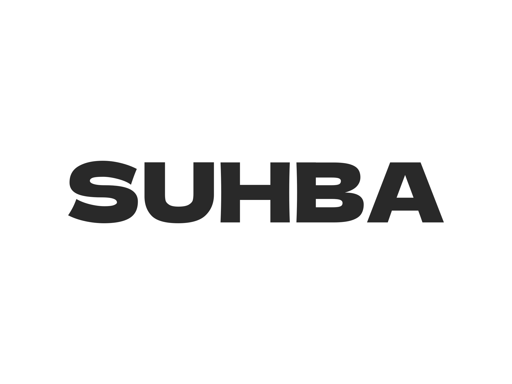

# SUHBA - Chat Project - ITI

**Project Name**: SUHBA  
**Slogan**: _"Where Connections Come Alive"_  
**Logo**: 


---

## Mission

Our mission is to provide a **secure, scalable, and user-friendly messaging platform** that enables seamless communication through **one-to-one chats**, **group chats**, **file sharing**, and **advanced features** like voice/video calls and chatbot integration. We aim to empower users with a reliable tool for both personal and professional communication.

---

## Vision

To become a **leading messaging platform** that revolutionizes how people connect, collaborate, and share information. We envision a world where communication is **effortless, secure, and enriched** with innovative features that enhance user experience.

---

## Slogan

_"Where Connections Come Alive"_  
Our slogan reflects our commitment to creating a platform that brings people closer, fostering meaningful connections through technology.

---

## Logo

The SUHBA logo represents **connection, innovation, and trust**.





## UI Structure

### Server UI

The server UI consists of five main screens for managing and monitoring server activities. Below is the structure:

```
ui/
└── server/
    ├── 1- Server Management.png
    ├── 2- Statistics.png
    ├── 3- Broadcasting.png
    ├── 4- User Management.png
    └── 5- Settings.png
```

#### Screens Overview:

1. **Server Management**:

   - Monitor server status, start/stop services, and manage active connections.


2. **Statistics**:

- View real-time user activity metrics.


3. **Broadcasting**:

   - Manage broadcast messages and history.
     

4. **User Management**:

   - Administer user accounts, roles, and permissions.
     

5. **Settings**:
   - Configure admin settings, notifications, and security preferences.


---

### Client UI (To Be Added)

The client UI will provide an intuitive interface for users to interact with the chat application. Details will be added soon.

---

## Database

The application uses a **secure and scalable database** to store:

- User profiles and credentials.
- Chat history and messages.
- File transfer logs.
- Server statistics and activity logs.

---

## Technologies Used

- **Frontend**: JavaFX
- **Backend**: Java, RMI (Remote Method Invocation)
- **Database**: (To be added, e.g., MySQL, PostgreSQL)
- **Build Tool**: Maven
- **Other Tools**: XML for configuration, encryption for security.

---

## Installation and Setup

1. Clone the repository:
   ```bash
   git clone https://github.com/your-repo/chat-project-iti.git
   ```
2. Navigate to the project directory:
   ```bash
   cd chat-project-iti
   ```
3. Build the project using Maven:
   ```bash
   mvn clean install
   ```
4. Run the server and client applications.

---

## Contributing

Contributions are welcome! Please follow these steps:

1. Fork the repository.
2. Create a new branch for your feature or bugfix.
3. Submit a pull request with a detailed description of your changes.

---

## License

This project is licensed under the **MIT License**. See the [LICENSE](LICENSE) file for details.

---
