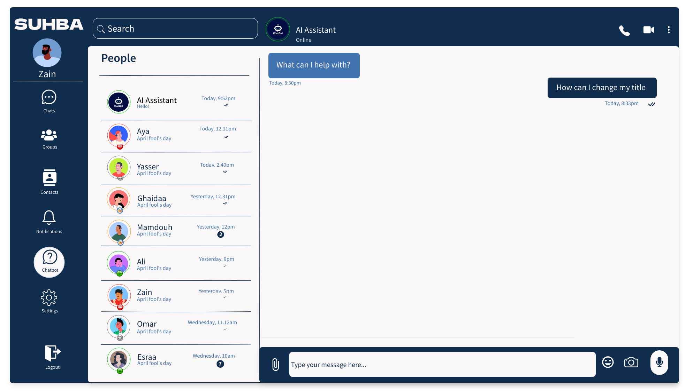

# SUHBA - Chat Project - ITI

**Project Name**: SUHBA  
**Slogan**: _"Where Connections Come Alive"_  
**Logo**: 

---

## 🔹 About the Project

SUHBA is a **Java-based desktop chat application** developed as part of the **ITI 9-Month Professional Training Program**. This project serves as a practical implementation of **software engineering principles**, demonstrating expertise in **desktop application development, system architecture, and database design**.

### **📌 What This Project Showcases**

✔ **JavaFX with FXML** for a responsive, user-friendly UI  
✔ **JDBC with MySQL** for secure and scalable database management  
✔ **RMI (Remote Method Invocation)** for efficient client-server communication  
✔ **Singleton & MVC design patterns** for scalability and maintainability  
✔ **SOLID Principles** and **interface-driven development** for clean architecture  
✔ **AI Chatbot Integration Using Gemini API**  
✔ **Concurrency & Multithreading** for high-performance communication  
✔ **Secure Authentication & Data Protection**

---

## 🎯 Key Features

✅ **One-to-One & Group Chat** – Real-time messaging with text formatting and file sharing  
✅ **Status & Presence** – Online/offline indicators, availability modes (Available, Busy, Away)  
✅ **Secure Authentication** – User login via **phone number & password validation**  
✅ **AI Chatbot** – Integrated with **Gemini API** for automated responses  
✅ **File Sharing** – Supports **documents, images, and videos**  
✅ **Admin Dashboard** – Server-side management for **monitoring and announcements**  
✅ **Multi-Client Communication** – **RMI-based** for secure, distributed networking  
✅ **Modern UI/UX** – Developed with **JavaFX, FXML**, and CSS for a **seamless user experience**

---

## Mission

Our mission is to provide a **secure, scalable, and user-friendly messaging platform** that enables seamless communication through **one-to-one chats**, **group chats**, **file sharing**, and **advanced features** like voice/video calls and chatbot integration. We aim to empower users with a reliable tool for both personal and professional communication.

---

## Vision

To become a **leading messaging platform** that revolutionizes how people connect, collaborate, and share information. We envision a world where communication is **effortless, secure, and enriched** with innovative features that enhance user experience.

---

## Slogan

_"Where Connections Come Alive"_  
Our slogan reflects our commitment to creating a platform that brings people closer, fostering meaningful connections through technology.

---

## Project Management

We use **Trello** and **Discord** for project management and team collaboration. These tools help us stay organized, track progress, and communicate effectively throughout the development process.

- **Trello**: Used for task management, sprint planning, and tracking project milestones.
- **Discord**: Used for real-time communication, team meetings, and discussions.

---

## Color Palette

We use a **calm and professional color palette** to ensure a visually appealing and user-friendly interface. The colors are chosen to provide a clean and modern look while maintaining readability and accessibility.

### Color Palette:

- **#F9F7F7**: Very light gray (used for backgrounds and light mode).
- **#DBE2EF**: Light blue-gray (used for secondary elements and input fields).
- **#3F72AF**: Medium blue (used for primary buttons, accents, and highlights).
- **#112D4E**: Dark navy blue (used for text, dark mode backgrounds, and headers).

### Usage:

- **Backgrounds**: `#F9F7F7` for light mode, `#112D4E` for dark mode.
- **Text**: `#112D4E` for primary text, `#3F72AF` for accents.
- **Buttons**: `#3F72AF` for primary buttons, `#DBE2EF` for secondary buttons.
- **Borders/Dividers**: `#DBE2EF` for subtle borders and dividers.

You can view the color palette on [Color Hunt](https://colorhunt.co/palette/f9f7f7dbe2ef3f72af112d4e).

---

---

## 🏗️ System Architecture & Design

### **📌 MVC Architecture for Scalability & Maintainability**

Our system follows the **Model-View-Controller (MVC) design pattern**, ensuring **modular, clean, and scalable development**.

| **Layer**      | **Responsibilities**                                                |
| -------------- | ------------------------------------------------------------------- |
| **Model**      | Business logic, database access (JDBC, DAO).                        |
| **View**       | JavaFX UI, dynamic updates using FXML.                              |
| **Controller** | Handles user interactions and updates the view based on model data. |

✅ **Separation of Concerns** – Clean division between UI, logic, and data  
✅ **Scalability** – Easily extendable with new features  
✅ **Testability** – Supports unit testing with mock implementations

---

### **📌 Singleton Pattern for Resource Management**

To optimize performance and **prevent redundant instances**, we use the **Singleton Pattern** for:

✅ **Database Access** – Ensuring a single connection instance  
✅ **RMI Server Instance** – Managing distributed connections efficiently  
✅ **Configuration Management** – Centralized settings handling

## 🚀 **Result:** Secure, thread-safe, and optimized database access.

## Database

The application uses a **secure and scalable database** to store:

- User profiles and credentials.
- Chat history and messages.
- File transfer logs.
- Server statistics and activity logs.

# Database Schema

This section provides an overview of the database schema for the **SUHBA Chat Application**. The schema is designed to support user management, messaging, group chats, contacts, and administrative functionalities.

## Schema Diagram

For a visual representation of the database schema, refer to the following diagram:

## SQL Script

The SQL script for creating the database schema can be found at:  
**Relative Path**: `mysql.sql`

[View SQL Script](databaseSchema/drawSQL-mysql-export-2025-02-15.sql)

### **📌 Database Optimization & Security**

✔ **Indexing on frequently searched fields** (`userId`, `phone`, `email`)  
✔ **Foreign Key Constraints** for **data integrity**  
✔ **Normalization (3NF)** to **eliminate redundancy**  
✔ **SQL Injection Protection** with **Prepared Statements**

🚀 **Result:** Secure, scalable, and efficient database management.

---

## 🎨 UI/UX Enhancements & User Experience Design

### **📌 JavaFX & FXML for a Modern UI**

🔹 **Scene Builder** for intuitive UI layout  
🔹 **CSS Styling** for a clean, modern interface  
🔹 **Dark & Light Mode Support** for accessibility

✔ **Real-time Chat Updates** – Messages appear dynamically  
✔ **Smooth Animations** – Enhances interactivity  
✔ **Drag & Drop File Sharing** – User-friendly media sharing  
✔ **Keyboard Shortcuts** – Quick navigation for power users

🚀 **Outcome:** A **clean, intuitive, and engaging user interface**.

### Sign in/up

The client UI will provide an intuitive interface for users to interact with the chat application. Details will be added soon.

1. **Sign Up**

1. **Sign In**

### Client UI

The client UI will provide an intuitive interface for users to interact with the chat application. Details will be added soon.

1. **Chat**
   - Users can engage in one-to-one or group chats with rich text messaging features.

2. **Contacts**

   - Displays the user's contact list with status updates (online/offline).

3. **Add Contacts**

   - Users can search for and add new contacts by entering phone numbers or email addresses.

4. **Groups**
   - Users can create, join, and manage groups for collaborative conversations.

5. **Notifications**
   - Displays notifications for new messages, contact requests, and other updates.

6. **Caht Bot**

   - Users can interact with an AI-powered chatbot for quick assistance and information.

7. **Settings**
   - Users can manage their profile, password, and app preferences.

### Server UI

The server UI consists of five main screens for managing and monitoring server activities. Below is the structure:

#### Screens Overview:

1. **Server Management**:

   - Monitor server status, start/stop services, and manage active connections.

2. **Statistics**:

   - View real-time user activity metrics.

3. **Broadcasting**:

   - Manage broadcast messages and history.

4. **User Management**:

   - Administer user accounts, roles, and permissions.

5. **Settings**:
   - Configure admin settings, notifications, and security preferences.

---

---

## 📜 Technology Summary

| **Category**             | **Technology Used**                                   |
| ------------------------ | ----------------------------------------------------- |
| **Programming Language** | Java                                                  |
| **Frontend (GUI)**       | JavaFX, FXML, CSS                                     |
| **Backend**              | Java (Core, Advanced), RMI (Remote Method Invocation) |
| **Database**             | MySQL, JDBC, DAO Pattern                              |
| **Networking**           | Java Networking API, RMI                              |
| **AI & Chatbot**         | Gemini API for intelligent chatbot interactions       |
| **Security**             | Secure authentication, password hashing               |
| **Software Engineering** | MVC, Singleton, SOLID Principles                      |
| **Project Management**   | Maven                                                 |
| **Version Control**      | Git, GitHub for collaboration                         |

---

## 🤝 Contributors

📌 **Team Members:**

- [Ahmed Yasser Elbrmbaly](https://github.com/ahmedelbrmbaly)
- [Ahmed Mamdouh](https://github.com/Dev-Ahmed-Mamdouh)
- [Aya Hathout](https://github.com/ayaHathout)
- [Ghaidaa Eldsoky](https://github.com/ghaidaaeldsoky)

📌 **Mentors & Instructors:**

- JETS, ITI

---

## License

This project is licensed under the **MIT License**. See the [LICENSE](LICENSE) file for details.

---
