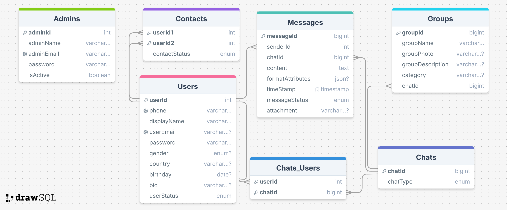

# SUHBA - Chat Project - ITI

**Project Name**: SUHBA  
**Slogan**: _"Where Connections Come Alive"_  
**Logo**: 

---

## Mission

Our mission is to provide a **secure, scalable, and user-friendly messaging platform** that enables seamless communication through **one-to-one chats**, **group chats**, **file sharing**, and **advanced features** like voice/video calls and chatbot integration. We aim to empower users with a reliable tool for both personal and professional communication.

---

## Vision

To become a **leading messaging platform** that revolutionizes how people connect, collaborate, and share information. We envision a world where communication is **effortless, secure, and enriched** with innovative features that enhance user experience.

---

## Slogan

_"Where Connections Come Alive"_  
Our slogan reflects our commitment to creating a platform that brings people closer, fostering meaningful connections through technology.

---

## Logo

The SUHBA logo represents **connection, innovation, and trust**.


## UI Structure

### Sign in/up

The client UI will provide an intuitive interface for users to interact with the chat application. Details will be added soon.

1. **Sign Up**


2. **Sign In**


### Client UI (To Be Added)

The client UI will provide an intuitive interface for users to interact with the chat application. Details will be added soon.

1. Chat
   - Users can engage in one-to-one or group chats with rich text messaging features.


2. Contacts

   - Displays the user's contact list with status updates (online/offline).


3. Add Contacts

   - Users can search for and add new contacts by entering phone numbers or email addresses.
     

4. Groups
   - Users can create, join, and manage groups for collaborative conversations.


5. Notifications
   - Displays notifications for new messages, contact requests, and other updates.


6. Settings
   - Users can manage their profile, password, and app preferences.


### Server UI

The server UI consists of five main screens for managing and monitoring server activities. Below is the structure:

```
ui/
└── server/
    ├── 1- Server Management.png
    ├── 2- Statistics.png
    ├── 3- Broadcasting.png
    ├── 4- User Management.png
    └── 5- Settings.png
```

#### Screens Overview:

1. **Server Management**:

   - Monitor server status, start/stop services, and manage active connections.


2. **Statistics**:

   - View real-time user activity metrics.


3. **Broadcasting**:

   - Manage broadcast messages and history.


4. **User Management**:

   - Administer user accounts, roles, and permissions.


5. **Settings**:
   - Configure admin settings, notifications, and security preferences.


---

## Database

The application uses a **secure and scalable database** to store:

- User profiles and credentials.
- Chat history and messages.
- File transfer logs.
- Server statistics and activity logs.

# Database Schema

This section provides an overview of the database schema for the **SUHBA Chat Application**. The schema is designed to support user management, messaging, group chats, contacts, and administrative functionalities.

## Schema Diagram

For a visual representation of the database schema, refer to the following diagram:



## SQL Script

The SQL script for creating the database schema can be found at:  
**Relative Path**: `mysql.sql`

[View SQL Script](databaseSchema/mysql.sql)

## Schema Overview

The database consists of the following tables:

### 1. **Users**

- Stores user information such as phone number, display name, email, password, gender, country, birthday, bio, and status.
- **Primary Key**: `userId`
- **Indexes**: `userId`, `phone`, `userEmail`

### 2. **Contacts**

- Manages relationships between users, including contact status and category.
- **Primary Key**: `userId2`
- **Indexes**: `userId1`

### 3. **Messages**

- Stores messages sent by users, including content, timestamp, status, and attachments.
- **Primary Key**: `messageId`
- **Indexes**: `senderId`, `messageId`

### 4. **Receivers**

- Tracks recipients of messages, including individual users and groups.
- **Primary Key**: `receiverId`
- **Indexes**: `messageId`, `groupId`

### 5. **Groups**

- Manages group information such as group name, photo, and description.
- **Primary Key**: `groupId`
- **Indexes**: `groupId`

### 6. **Groups_Users**

- Tracks user membership in groups and their status within the group.
- **Primary Key**: `userId`
- **Indexes**: `groupId`, `userId`

### 7. **Admins**

- Stores administrator information, including name, email, password, and active status.
- **Primary Key**: `adminId`
- **Indexes**: `adminId`, `adminEmail`

### 8. **Admins_Permissions**

- Manages permissions assigned to administrators.
- **Primary Key**: `permissionId`
- **Indexes**: `adminId`

### 9. **Permissions**

- Defines types of permissions available for administrators.
- **Primary Key**: `permissionId`
- **Indexes**: `permissionId`

## Relationships

- **Contacts**:

  - `userId2` references `Users(userId)`
  - `userId1` references `Users(userId)`

- **Messages**:

  - `senderId` references `Users(userId)`
  - `messageId` references `Receivers(messageId)`

- **Groups**:

  - `groupId` references `Groups_Users(groupId)`
  - `groupId` references `Receivers(groupId)`

- **Admins**:

  - `adminId` references `Admins_Permissions(adminId)`

- **Permissions**:

  - `permissionId` references `Admins_Permissions(permissionId)`

- **Users**:
  - `userId` references `Receivers(receiverId)`
  - `userId` references `Groups_Users(userId)`

---

## Technologies Used

- **Frontend**: JavaFX
- **Backend**: Java, RMI (Remote Method Invocation)
- **Database**: (To be added, e.g., MySQL, PostgreSQL)
- **Build Tool**: Maven
- **Other Tools**: XML for configuration, encryption for security.

---

## Installation and Setup

1. Clone the repository:
   ```bash
   git clone https://github.com/your-repo/chat-project-iti.git
   ```
2. Navigate to the project directory:
   ```bash
   cd chat-project-iti
   ```
3. Build the project using Maven:
   ```bash
   mvn clean install
   ```
4. Run the server and client applications.

---

## Contributing

Contributions are welcome! Please follow these steps:

1. Fork the repository.
2. Create a new branch for your feature or bugfix.
3. Submit a pull request with a detailed description of your changes.

---

## License

This project is licensed under the **MIT License**. See the [LICENSE](LICENSE) file for details.

---
